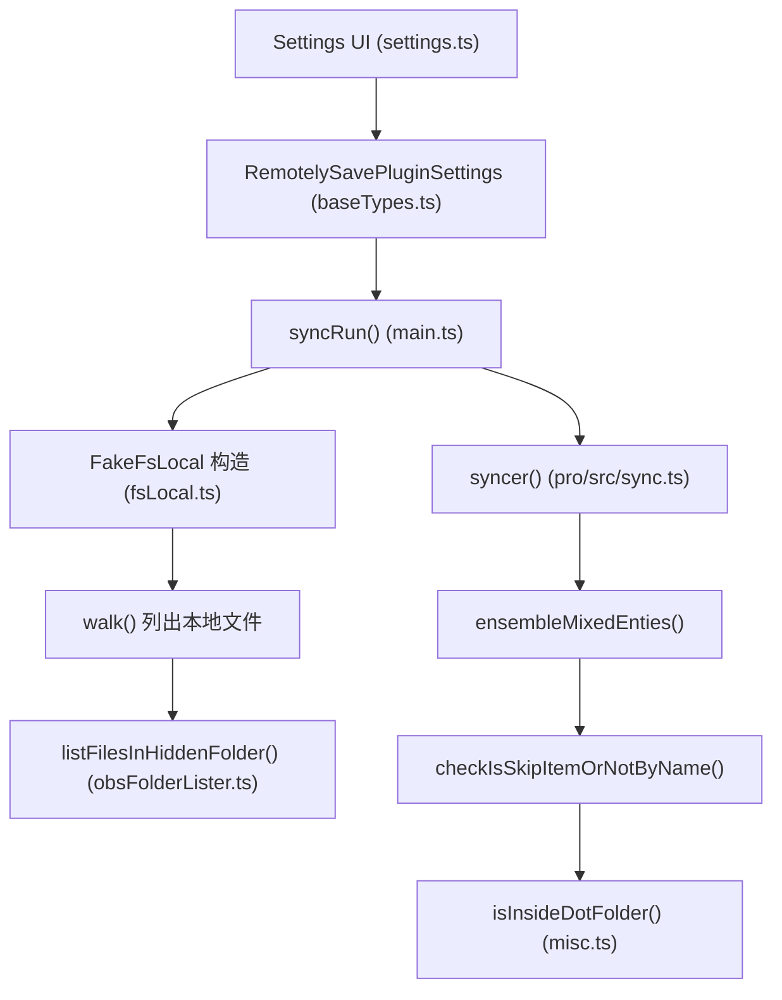

# 同步隐藏文件夹（dot folders）

**创建日期**：2026-02-09
**完成日期**：2026-02-09
**状态**：已完成

## 用户需求

用户 fork 了 Obsidian 的 remotely-save 插件源码，需要新增一个功能：支持同步指定的以 `.` 开头的隐藏文件夹。

## 产品概述

当前 remotely-save 插件在同步时，会无条件跳过所有以 `.` 开头的隐藏文件/文件夹（`.obsidian` 目录有单独的开关控制）。用户需要在设置界面中新增一个配置项，允许用户指定需要同步的隐藏文件夹列表（如 `.stversions`、`.trash` 等），从而将这些隐藏文件夹纳入同步范围。

## 核心功能

1. **新增设置项**：在高级设置区域增加一个"同步指定的隐藏文件夹"开关（默认关闭），开启后显示一个文本输入框，让用户填写需要同步的隐藏文件夹名称列表（每行一个）
2. **修改过滤逻辑**：在同步过滤链中，对于用户指定的隐藏文件夹路径不再跳过，将其纳入同步范围
3. **本地文件列表扩展**：由于 Obsidian 的 `vault.getAllLoadedFiles()` 不会返回隐藏文件夹的内容，需要像 `.obsidian` 目录一样使用 `vault.adapter.list()` 递归列出指定隐藏文件夹中的文件
4. **国际化支持**：为新设置项添加中文（简体/繁体）和英文的翻译文本

## 技术栈

- 语言：TypeScript
- 框架：Obsidian Plugin API
- 构建：esbuild / webpack
- 现有依赖：lodash, XRegExp, @fyears/tsqueue 等

## 实现方案

### 整体策略

参照现有 `syncUnderscoreItems`（开关型）和 `syncConfigDir`（需要额外文件列表收集）的模式，新增 `syncDotItems` 开关 + `syncDotFolders` 文件夹名称列表两个配置项。在过滤逻辑的 `checkIsSkipItemOrNotByName()` 中，对用户指定的隐藏文件夹路径做豁免处理；在本地文件列表的 `FakeFsLocal.walk()` 中，额外使用 `vault.adapter.list()` 递归列出这些隐藏文件夹的内容。

### 关键技术决策

1. **配置结构**：新增 `syncDotItems: boolean`（总开关，默认 false）和 `syncDotFolders: string[]`（隐藏文件夹名称列表，默认空数组）两个设置字段。使用列表而非单个路径，允许用户灵活指定多个隐藏文件夹。

2. **过滤逻辑修改点**：在 `pro/src/sync.ts` 的 `checkIsSkipItemOrNotByName()` 函数中，当 `finalIsIgnored === undefined` 时执行隐藏路径检查（第 247-256 行）。需要在此处增加判断：如果 `syncDotItems` 开启且路径属于 `syncDotFolders` 中指定的文件夹，则不标记为忽略。具体做法是将 `isHiddenPath(key, true, false)` 的结果与用户指定的文件夹白名单做交叉判断。

3. **本地文件列表收集**：在 `FakeFsLocal.walk()` 中，参照已有的 `.obsidian` 目录处理模式（第 102-116 行），当 `syncDotItems` 开启时，遍历 `syncDotFolders` 列表，对每个文件夹调用类似 `listFilesInObsFolder()` 的递归函数来收集文件。可复用 `obsFolderLister.ts` 中的 `listFilesInObsFolder()` 函数或基于其模式编写一个通用的 `listFilesInHiddenFolder()` 函数。

4. **参数传递链**：`syncDotItems` 和 `syncDotFolders` 需要从 `settings` 传递到以下位置：

- `FakeFsLocal` 构造函数 -> 用于 `walk()` 时收集隐藏文件夹文件
- `ensembleMixedEnties()` -> 传递给 `checkIsSkipItemOrNotByName()`
- `checkIsSkipItemOrNotByName()` -> 最终过滤判断

## 实现要点

- **`checkIsSkipItemOrNotByName()` 修改细节**：新增 `syncDotFolders` 参数。在第 237 行（`.obsidian` 判断区块结束后）与第 239 行（`isSpecialFolderNameToSkip` 检查之前），增加一段逻辑：如果 `syncDotItems` 开启，检查 `key` 是否属于 `syncDotFolders` 中的某个文件夹（即 `key` 以某个 dotFolder 开头或就是该 dotFolder 本身），若是则将 `finalIsIgnored` 设为 `false`。这样后续的 `isHiddenPath` 检查不会覆盖此决定（因为第 253 行只在 `finalIsIgnored === undefined` 时执行）。

- **`isInsideDotFolder()` 辅助函数**：在 `misc.ts` 中新增，接收 `key: string` 和 `dotFolders: string[]`，判断 `key` 是否属于某个指定的隐藏文件夹。匹配逻辑：`key === folderName + "/"` 或 `key.startsWith(folderName + "/")`。

- **`FakeFsLocal` 改动**：构造函数新增 `syncDotItems` 和 `syncDotFolders` 参数。在 `walk()` 方法中 syncConfigDir 处理之后，如果 `syncDotItems` 开启，对每个 `syncDotFolders` 中的文件夹名，先用 `vault.adapter.exists()` 检查是否存在，若存在则递归列出其内容并加入结果列表。

- **复用 `listFilesInObsFolder`**：该函数的核心逻辑（BFS + `vault.adapter.list()` + `statFix()`）可以基本复用。需要调整的是：不需要 `bookmarksOnly` 的过滤逻辑，不需要 `isPluginDirItself` 的特殊处理。在 `obsFolderLister.ts` 中新增一个通用的 `listFilesInHiddenFolder(folderPath: string, vault: Vault)` 函数。

- **设置界面**：参照 `syncUnderscoreItems` 的下拉选择模式添加开关。开关后面添加一个 TextArea，让用户输入要同步的隐藏文件夹名称（每行一个，不含路径前缀，如 `.stversions`）。

- **防御性处理**：用户输入的文件夹名需要做基本校验 — 必须以 `.` 开头；自动排除 `.obsidian`（已有单独处理）和 `.git`/`.github`/`.gitlab`/`.svn` 等（在 `isSpecialFolderNameToSkip` 中始终跳过）；去重；去除首尾空格。

## 架构设计

### 数据流



### 修改链路

1. `baseTypes.ts` -> 新增 `syncDotItems` 和 `syncDotFolders` 字段
2. `main.ts` -> 默认设置增加新字段，`FakeFsLocal` 构造传入新参数
3. `misc.ts` -> 新增 `isInsideDotFolder()` 辅助函数
4. `obsFolderLister.ts` -> 新增 `listFilesInHiddenFolder()` 函数
5. `fsLocal.ts` -> 构造函数和 `walk()` 方法扩展
6. `pro/src/sync.ts` -> `checkIsSkipItemOrNotByName()` 和 `ensembleMixedEnties()` 增加参数和逻辑
7. `src/langs/*.json` -> 新增 i18n 文本
8. `settings.ts` -> 新增设置界面

## 目录结构

```
.obsidian/plugins/remotely-save-new/
├── src/
│   ├── baseTypes.ts           # [MODIFY] 在 RemotelySavePluginSettings 接口中新增 syncDotItems?: boolean 和 syncDotFolders?: string[] 两个可选字段
│   ├── main.ts                # [MODIFY] 1) DEFAULT_SETTINGS 中增加 syncDotItems: false, syncDotFolders: [] 默认值; 2) syncRun() 中 FakeFsLocal 构造传入新参数; 3) 第二处 FakeFsLocal 构造（sync-on-save）同样传入
│   ├── misc.ts                # [MODIFY] 新增 isInsideDotFolder(key: string, dotFolders: string[]): boolean 辅助函数
│   ├── obsFolderLister.ts     # [MODIFY] 新增 listFilesInHiddenFolder(folderPath: string, vault: Vault): Promise<Entity[]> 通用递归列出函数
│   ├── fsLocal.ts             # [MODIFY] FakeFsLocal 构造函数新增 syncDotItems/syncDotFolders 参数；walk() 方法末尾增加对指定隐藏文件夹的文件列表收集
│   ├── settings.ts            # [MODIFY] 高级设置区域（syncUnderscoreItems 附近）新增"同步隐藏文件夹"开关和文件夹名称 TextArea 输入框
│   ├── langs/
│   │   ├── en.json            # [MODIFY] 新增 settings_syncdotitems / settings_syncdotitems_desc / settings_syncdotfolders_desc 翻译键
│   │   ├── zh_cn.json         # [MODIFY] 新增对应中文简体翻译
│   │   └── zh_tw.json         # [MODIFY] 新增对应中文繁体翻译
│   └── i18n.ts                # [无需修改] 自动从 langs 合并加载
├── pro/
│   └── src/
│       └── sync.ts            # [MODIFY] 1) checkIsSkipItemOrNotByName() 新增 syncDotItems/syncDotFolders 参数，在 .obsidian 判断后增加隐藏文件夹豁免逻辑; 2) ensembleMixedEnties() 新增参数传递; 3) syncer() 调用处从 settings 传递新参数
```

## 关键代码结构

```typescript
// misc.ts - 新增辅助函数签名
export const isInsideDotFolder = (
  key: string, 
  dotFolders: string[]
): boolean => {
  // 判断 key 是否属于 dotFolders 中指定的某个隐藏文件夹
  // 匹配: key === "folderName/" 或 key.startsWith("folderName/")
};
```

```typescript
// baseTypes.ts - 新增字段（追加到 RemotelySavePluginSettings 接口）
syncDotItems?: boolean;
syncDotFolders?: string[];
```

## Agent Extensions

### SubAgent

- **code-explorer**
- 用途：在实现前探索代码库中的依赖关系，确认修改点的上下游影响
- 预期结果：精确定位所有需要修改的代码位置和传参链路
