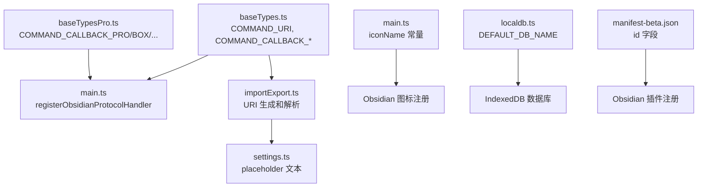

## 用户需求

本插件是从 remotely-save 源码仓库 fork 出来的独立插件。当此插件（remotely-save-new）与原版 remotely-save 同时安装在 Obsidian 中时，无法同时启用，会提示插件加载失败。需要修改代码使两个插件能够在 Obsidian 中同时共存并正常运行。

## 产品概述

将 fork 插件中所有与原版 remotely-save 冲突的运行时标识符全部重命名为独立的命名，包括 Protocol Handler URI、OAuth 回调 URI、自定义图标名、本地数据库名、以及 UI 中硬编码的 URI 字符串，确保两个插件在 Obsidian 运行时互不干扰。

## 核心功能

- 修改 manifest-beta.json 的插件 ID 为 `remotely-save-new`
- 将所有 Obsidian Protocol Handler URI 从 `remotely-save` 改为 `remotely-save-new`
- 将所有 OAuth 回调 URI 从 `remotely-save-cb-*` 改为 `remotely-save-new-cb-*`
- 将自定义图标名从 `remotely-save-*` 改为 `remotely-save-new-*`
- 将本地 IndexedDB 数据库名从 `remotelysavedb` 改为 `remotelysavenewdb`
- 修复 URI 解析和 UI 展示中硬编码的 `obsidian://remotely-save` 字符串
- 不修改远程元数据文件名、OneDrive 路径、GitHub 链接等不影响运行时冲突的内容

## 技术栈

- 语言: TypeScript
- 构建工具: esbuild / webpack
- 运行平台: Obsidian 插件 (基于 Obsidian API)
- 数据存储: IndexedDB (通过 localdb 模块)

## 实现方案

### 策略概述

本次修改为纯标识符重命名，不涉及逻辑变更。所有修改集中在常量定义和少量硬编码字符串上，通过修改源头常量定义，让所有引用这些常量的下游代码自动获得新值，最小化修改范围和回归风险。

### 关键技术决策

1. **常量源头修改策略**: `COMMAND_URI` 和 `COMMAND_CALLBACK_*` 常量在 `baseTypes.ts` 和 `baseTypesPro.ts` 中定义，下游通过 import 引用。修改源头定义即可，无需修改下游文件（`main.ts`、`fsDropbox.ts`、`fsOnedrive.ts` 等），这是最安全高效的方式。
2. **硬编码字符串处理**: `importExport.ts` 第 88 行的硬编码 URI 校验字符串应改为使用 `COMMAND_URI` 常量拼接，既修复冲突又提升可维护性。`settings.ts` 的 placeholder 为纯 UI 文本，直接替换字符串即可。
3. **数据库名隔离**: 数据库名修改为 `remotelysavenewdb`，确保两个插件使用独立的 IndexedDB 数据库，避免数据相互覆盖。注意：已有用户若从原版迁移过来，历史数据不会自动迁移，这是预期行为（两个插件独立运行）。
4. **不修改的部分**: 远程元数据文件名（`_remotely-save-metadata-on-remote.json/bin`）、OneDrive App 文件夹路径正则、注释中的 GitHub 链接、`package.json` 的 `name` 字段均不需修改，它们不会造成 Obsidian 运行时冲突。

## 实现备注

### 回归风险控制

- 所有 `COMMAND_CALLBACK_*` 常量的修改会影响 OAuth 回调流程，需要确保对应的 OAuth 应用（OneDrive、Dropbox、Box、pCloud 等）注册的回调 URI 也同步更新，否则 OAuth 认证会失败。这是部署层面的注意事项，代码层面只需修改常量值即可。
- 图标名修改不影响功能，仅影响 Obsidian 内部图标注册的唯一性标识。

### 向后兼容

- 数据库名变更意味着全新安装，不会读取原版插件的同步历史。这是期望的隔离行为。
- Protocol Handler URI 变更意味着旧的 QR 码导出/导入 URI 不兼容，用户需要重新生成。

## 架构设计

本次修改不涉及架构变更，仅修改标识符常量。修改的传播路径如下：



## 目录结构

```
project-root/
├── manifest-beta.json                # [MODIFY] 修改 id 字段从 "remotely-save" 为 "remotely-save-new"
├── src/
│   ├── baseTypes.ts                  # [MODIFY] 修改 COMMAND_URI、COMMAND_CALLBACK、COMMAND_CALLBACK_ONEDRIVE、COMMAND_CALLBACK_DROPBOX 四个常量值，加入 "-new" 后缀
│   ├── main.ts                       # [MODIFY] 修改三个图标名常量 iconNameSyncWait、iconNameSyncRunning、iconNameLogs，从 "remotely-save-*" 改为 "remotely-save-new-*"
│   ├── localdb.ts                    # [MODIFY] 修改 DEFAULT_DB_NAME 从 "remotelysavedb" 为 "remotelysavenewdb"
│   ├── importExport.ts              # [MODIFY] 修改第88行硬编码 URI 校验字符串，改为使用 COMMAND_URI 常量拼接
│   └── settings.ts                   # [MODIFY] 修改第2745行 placeholder 文本中的 "remotely-save" 为 "remotely-save-new"
└── pro/
    └── src/
        └── baseTypesPro.ts           # [MODIFY] 修改 COMMAND_CALLBACK_PRO、COMMAND_CALLBACK_BOX、COMMAND_CALLBACK_PCLOUD、COMMAND_CALLBACK_YANDEXDISK、COMMAND_CALLBACK_KOOFR、COMMAND_CALLBACK_ONEDRIVEFULL 六个常量值，加入 "-new" 后缀
```